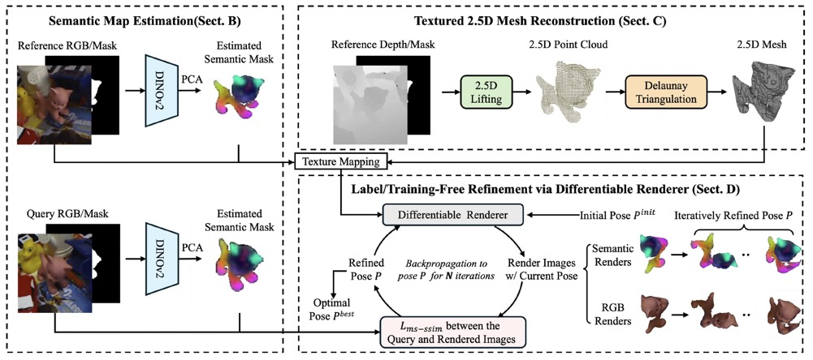

## Towards Human-Level 3D Relative Pose Estimation: Generalizable, Training-Free, with Single Reference

Official PyTorch Implementation of [Towards Human-Level 3D Relative Pose Estimation: Generalizable, Training-Free, with Single Reference](https://arxiv.org/abs/2406.18453).

Please also refer to our [video](https://youtu.be/Ajr9ugjtoDo) for more information.



If this code is helpful to your research, please consider citing [our paper](https://arxiv.org/abs/2406.18453) by:

```
@article{towards2024,
    title={Towards Human-level 3D Relative Pose Estimation: Zero-Shot Unseen Generalization, Label/Training-Free, and A Single Reference},
    author={Yuan Gao and Yajing Luo and Junhong Wang and Kui Jia and Gui-Song Xia},
    year={2024},
    journal={arXiv preprint arXiv:2406.18453}
}
```

## Setup
### 1. Python Environment and Dependencies
```
conda create -n relativ_pose_estimation python=3.9.16
pip install -r requirements.txt
```


### 2. Compile `nvidiffrast_culling`
```
cd nvdiffrast_culling
pip install .
```

### 3. Download Pretrained DINOv2 Model
```
mkdir third_party & cd third_party
git clone https://github.com/facebookresearch/dinov2.git
cd dinov2 & mkdir weights & cd weights
wget https://dl.fbaipublicfiles.com/dinov2/dinov2_vitl14/dinov2_vitl14_pretrain.pth
```

### 4. Download Dataset
```
mkdir bop_datasets & cd bop_datasets
wget https://huggingface.co/datasets/bop-benchmark/datasets/resolve/main/lm/lm_test_all.zip # LineMOD real image datasets
unzip lm_test_all.zip
```

### 5. Query-Reference Pairs Generation
The generated query-reference pairs for the LineMOD dataset that used in our experiments are uploaded at `data/gd_pairs`. Otherwise, the query-reference pairs can be automatically generated by [those codes](https://github.com/ethanygao/training-free_generalizable_relative_pose/blob/master/data/bop_dataset.py#L40-L44) if `data/gd_pairs` is empty.

## Evaluation (Note That Our Method Is Label/Training-Free)
Evaluate our method on the LineMOD dataset by running:
```
python run_lm.py
```

## Acknowledgements:
1. Our `nvdiffrast_culling` is modified based on [`nvdiffrast`](https://github.com/NVlabs/nvdiffrast).
2. The semantic features are extracted by [DINO v2](https://github.com/facebookresearch/dinov2.git).